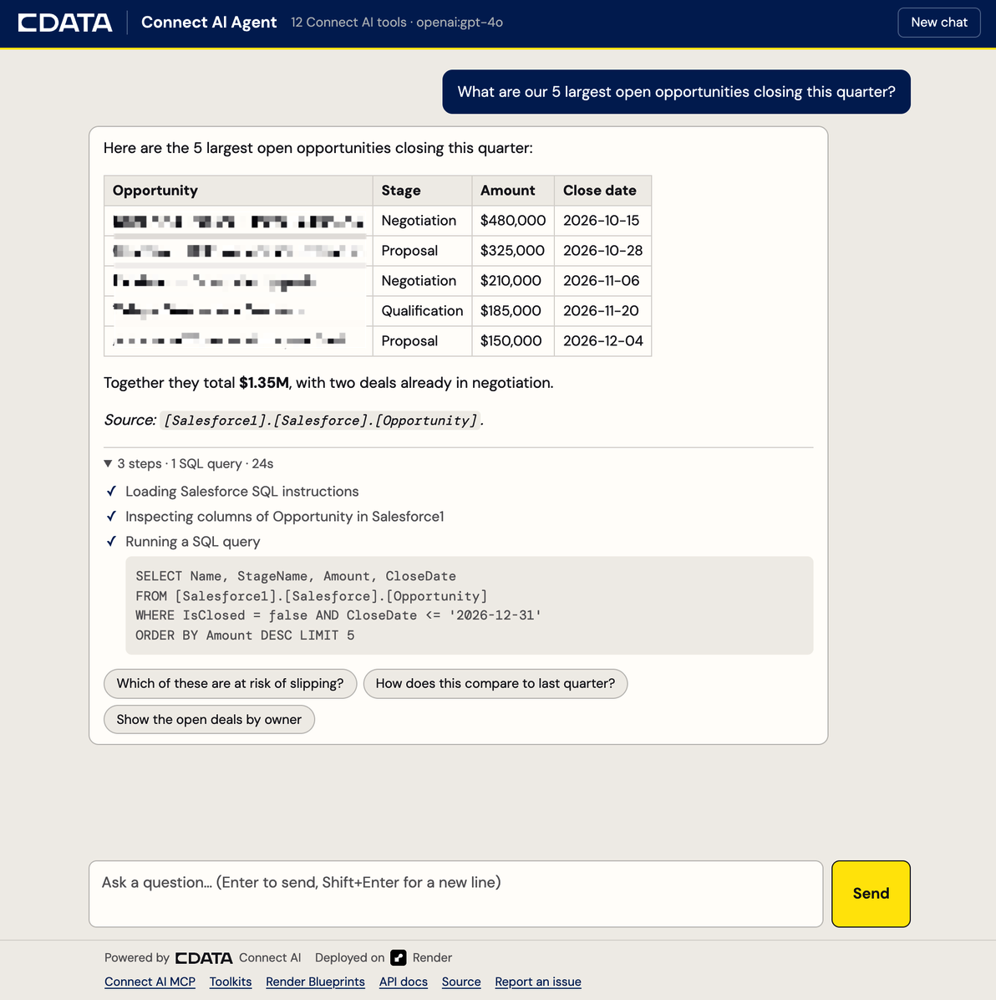

# CData Connect AI + Render Starter

A chatbot with live, governed access to hundreds of enterprise systems
(Salesforce, NetSuite, Snowflake, Jira, SharePoint and more). Deploy it to
Render in one click, or run it on your laptop with one command.

[](https://render.com/deploy?repo=https://github.com/jerodj-cdata/connect-ai-render-starter)

Ask it "What were our largest deals last quarter?" and it finds the right
connection, inspects the tables, writes the SQL, and answers with the source
cited. There is no ETL or data copy: every answer is a live query through
[CData Connect AI](https://www.cdata.com/ai/).


<sub>The included chat page, with opportunity names obscured.</sub>

## What you need

1. **A Connect AI account** with at least one connection. In
   [Connect AI](https://cloud.cdata.com), add one under **Sources**.
2. **A Connect AI Personal Access Token**, from **Settings** → **Access
   Tokens** ([how](https://docs.cloud.cdata.com/en/Settings/Personal-Access-Tokens)).
3. **An LLM API key**: [OpenAI](https://platform.openai.com/api-keys) or
   [Anthropic](https://platform.claude.com/settings/keys), or your own
   [OpenAI-compatible gateway](#local-models-and-llm-gateways).

## Get started

### Option A: Deploy to Render

1. Click **Deploy to Render** above.
2. Fill in the prompts:

   | Variable | Value |
   | --- | --- |
   | `CDATA_USERNAME` | your Connect AI login email (asked once per service) |
   | `CDATA_PAT` | your Personal Access Token (asked once per service) |
   | `OPENAI_API_KEY` / `ANTHROPIC_API_KEY` | the one for your provider; leave the other blank |
   | `SLACK_WEBHOOK_URL` | optional; leave blank to skip Slack |

3. When the deploy finishes, open the `connectai-agent` URL. The chat page asks
   for `APP_API_KEY` once: Render generated it, and it is on the web service's
   **Environment** tab.

### Option B: Run locally

You need [Docker](https://docs.docker.com/get-started/get-docker/)
([no Docker on your Mac?](#no-docker-on-your-mac)).

```bash
git clone https://github.com/jerodj-cdata/connect-ai-render-starter.git
cd connect-ai-render-starter
cp .env.example .env    # fill in the three values at the top
docker compose up
```

Open <http://localhost:8000> and start chatting. There is no API key to enter
locally: the agent only listens on `127.0.0.1`, so only your machine can reach
it.

The first `docker compose up` takes about 20 seconds to download and build;
later starts take a few seconds. If startup fails, the log's
`Startup failed:` line names the variable to fix, and `docker compose ps`
shows the agent as `unhealthy`. Edits under `app/` reload automatically;
edits to `.env` need another `docker compose up`.

## What's in the box

| Piece | What it is |
| --- | --- |
| **`connectai-agent`** | A chat page and API backed by a LangGraph agent. Its tools come from Connect AI's remote MCP server, so it can explore and query any source you connect. The page shows each step live while the agent works, every answer can expand to show the exact SQL it ran, and each answer ends with suggested follow-up questions to click. |
| **`connectai-agent-db`** | Postgres, which stores conversation history so chats survive restarts. |
| **`connectai-pipeline-digest`** *(optional)* | A weekday cron job that queries Salesforce with plain SQL through the [`cdata-connect-ai`](https://pypi.org/project/cdata-connect-ai/) Python connector. It shows the second path into Connect AI; the agent does not need it. |

## Configure

### Scope what the agent can see

By default the agent sees every connection your PAT can reach, including write
tools. For anything beyond a personal test, create a **Toolkit** in Connect AI
(Growth plan and up) with only read tools enabled, and set `CDATA_MCP_URL` to
its MCP Remote Server URL. On Render, that variable is in the
`connectai-shared` environment group.

### Choose a model

`LLM_MODEL` takes a `provider:model` string. OpenAI and Anthropic are
installed:

| `LLM_MODEL` | Key |
| --- | --- |
| `openai:gpt-4o` (default) | `OPENAI_API_KEY` |
| `anthropic:claude-sonnet-5` | `ANTHROPIC_API_KEY` |

On Render, change `LLM_MODEL` in the `connectai-shared` environment group and
set the matching key on the web service. Locally, edit `.env`.

To add another provider, such as Google or Bedrock, add its `langchain-*`
package to `requirements.in`, regenerate `requirements.txt` (the command is at
the top of `requirements.in`), and add its key variable to `LLM_API_KEYS` in
`app/config.py` so a missing key is caught at startup.

### Local models and LLM gateways

Any OpenAI-compatible endpoint works, including LiteLLM, vLLM, and Ollama's
own `/v1` API. Keep the `openai:` prefix and point the client at the gateway:

```bash
LLM_MODEL=openai:qwen3:14b         # the model name as the gateway knows it
OPENAI_BASE_URL=http://host.docker.internal:4000/v1
OPENAI_API_KEY=<the gateway's key> # any non-empty string if it has no auth
```

Inside Docker, `localhost` is the container itself, so use
`host.docker.internal` (or the machine's LAN address) for a gateway on your
computer. A gateway on your own network is not reachable from Render.

Pick a capable model. Most answers take four or more tool calls (load
instructions, list tables, inspect columns, query), and small models struggle.
In testing, Qwen3 8B skipped its tools and made up an answer, and Qwen3 14B
handled simple questions but lost track of multi-step ones.

### Follow-up suggestions

After each answer, the agent makes one extra, small call to the same model to
suggest three follow-up questions, shown as chips under the answer. They
arrive a few seconds after the answer, so they never slow it down, and if the
model returns something unusable, no chips appear. Set
`SUGGEST_FOLLOWUPS=false` to turn them off, for example to save cost.

### The pipeline digest (optional)

The cron job reads open Salesforce opportunities closing in the next 14 days,
stores a daily snapshot in Postgres, and optionally posts a summary to Slack.

- **Salesforce:** it queries `[Salesforce1].[Salesforce].[Opportunity]`. If
  your connection has a different name, set `CDATA_SF_CATALOG`.
- **Another source:** change `QUERY` in `jobs/pipeline_digest.py` to any
  `[Connection].[Schema].[Table]` your connections expose.
- **Not needed:** delete the cron service from `render.yaml`.

Run it on demand with `docker compose run --rm digest` locally, or **Trigger
Run** on Render. The logs should show `Fetched N open opportunities`.

## Use the API

The chat page is a thin client over a small API, documented interactively at
`/docs`. On Render, click **Authorize** there and paste `APP_API_KEY`; locally,
no key is needed.

```bash
curl http://localhost:8000/healthz
# {"status":"ok","mcp_tools":12,"llm_model":"openai:gpt-4o","auth_required":false}

curl -X POST http://localhost:8000/chat \
  -H "Content-Type: application/json" \
  -d '{"message": "What data sources can you reach?"}'
```

The reply includes `queries`, the SQL the agent ran for it. Against Render, use
your service URL and add `-H "Authorization: Bearer $APP_API_KEY"`. Send the
returned `thread_id` back with follow-up messages to continue a conversation.

To show progress as it happens, as the chat page does, call `/chat/stream`
with the same body. It returns newline-delimited JSON events:

```bash
curl -N -X POST http://localhost:8000/chat/stream \
  -H "Content-Type: application/json" \
  -d '{"message": "How many open opportunities do we have?"}'
# {"type": "start", "thread_id": "..."}
# {"type": "step", "id": "...", "tool": "getColumns", "label": "Inspecting columns of Opportunity in Salesforce1", "sql": null}
# {"type": "step_done", "id": "...", "ok": true}
# {"type": "step", "id": "...", "tool": "queryData", "label": "Running a SQL query", "sql": "SELECT COUNT(*) ..."}
# {"type": "step_done", "id": "...", "ok": true}
# {"type": "done", "thread_id": "...", "reply": "...", "queries": [{"sql": "SELECT COUNT(*) ...", "ok": true}]}
# {"type": "suggestions", "items": ["How has that changed since last quarter?", "..."]}
```

`suggestions` arrives a few seconds after `done` and is optional: it is
skipped if the model's reply can't be used, or if `SUGGEST_FOLLOWUPS=false`.
`/chat` never waits for suggestions and doesn't include them.

If the run fails partway, the last event is `{"type": "error", "detail": "..."}`
with the same actionable message `/chat` would return as a 502.

## Local development

Useful commands:

```bash
docker compose logs -f agent            # follow the agent's logs
docker compose run --rm digest          # run the cron job once
docker compose exec db psql -U agent    # inspect the database
docker compose down                     # stop; add -v to also wipe the database
```

### No Docker on your Mac?

[Colima](https://github.com/abiosoft/colima) is a free, lightweight engine:

```bash
brew install colima docker docker-compose docker-buildx
colima start
```

Then add `"cliPluginsExtraDirs": ["/opt/homebrew/lib/docker/cli-plugins"]` to
`~/.docker/config.json` so `docker compose` and `docker buildx` are found.
Colima shares only your home directory with containers, so keep the repo under
`~`.

### Without Docker for the app

Keep Postgres in Docker and run the app with Python 3.12. [uv](https://docs.astral.sh/uv/)
installs Python 3.12 for you if you don't have it:

```bash
docker compose up -d db
uv venv --python 3.12 .venv && uv pip install --python .venv -r requirements.txt
.venv/bin/uvicorn app.main:app --reload --env-file .env
set -a; source .env; set +a; .venv/bin/python -m jobs.pipeline_digest
```

## Troubleshooting

Startup and chat errors name the variable to fix. The common ones:

| Message | Fix |
| --- | --- |
| `Connect AI rejected the credentials (HTTP 401)` | `CDATA_USERNAME` must be your login email and `CDATA_PAT` a current token. Stray whitespace is stripped, but a truncated paste is not. |
| `LLM_MODEL=... needs OPENAI_API_KEY` | Set the key for your provider, or change `LLM_MODEL`. |
| `The LLM provider rejected the API key` | The LLM key is wrong or revoked. |
| `Could not connect to Postgres` | Locally, run `docker compose up -d db`. On Render, check `DATABASE_URL` is wired to the database. |
| `ended the session (Session terminated)` | `CDATA_MCP_URL` is wrong. Copy it from Connect AI again. |
| `Connect AI returned no result set` (digest) | Usually a wrong catalog: set `CDATA_SF_CATALOG` to your connection's name, as shown under **Sources**. |
| The agent answers with placeholder or made-up data | The model is not calling its tools: the answer shows no steps. Use a stronger model. |
| Many ✗ steps under an answer | The model is guessing at SQL and retrying. Expand the steps to see the failing queries; a stronger model, or a Toolkit with fewer tables, helps. |
| `mcp_tools: 0` in `/healthz` | The Toolkit has no tools enabled. |
| `port is already allocated` on `docker compose up` | Something else uses port 8000 or 5432 (often a local Postgres). Set `AGENT_PORT` or `DB_PORT` in `.env`, e.g. `DB_PORT=5433`. |
| Agent shows `unhealthy` in `docker compose ps` | Startup failed: `docker compose logs agent` shows the `Startup failed:` line. |

The agent loads its tools at startup, so a PAT revoked after a deploy shows up
as a 502 on `/chat`. Redeploy once it is fixed.

## Design choices

**Security.** The agent reaches live enterprise data, so on Render every
`/chat` call needs the bearer token Render generates at deploy time. The
system prompt tells the agent not to write data without confirmation, but a
prompt is a soft limit. The real guardrail belongs in Connect AI: a Toolkit
with only read tools, or a PAT for a read-only user.

**Conversation history lives in Postgres**, so chats survive redeploys. It
includes query results, so some source data lands in your database. To limit
that, conversations idle for 30 days are deleted automatically (checked at
startup and daily). Change it with `CONVERSATION_RETENTION_DAYS`, or set `0`
to keep everything. The pipeline digest's `pipeline_snapshot` table is not
affected; it is trend data you chose to keep.

**No CDN.** The chat page's two libraries (marked and DOMPurify) are vendored
in `app/static/vendor/`, so the page works offline and behind firewalls.

**Large results are trimmed.** Listing every table in a big Salesforce org
can return over 100K tokens. The agent caps each tool result and tells the
model how to narrow its request, which keeps it inside the model's context
window and keeps costs down.

**Credentials are entered twice on Render.** A Render environment group can't
hold prompted (`sync: false`) variables, so each service prompts for its own.

**Plans.** `render.yaml` sets none, so Render uses its defaults. Free web
instances spin down when idle, so use a paid plan for anything you demo live.

## Contributing

Issues and pull requests are welcome. See [CONTRIBUTING.md](CONTRIBUTING.md)
for setup and how to verify a change.

## License

[MIT](LICENSE) © CData Software, Inc. The CData and Render names and logos
are trademarks of their owners and are not covered by the license; see
[app/static/brand](app/static/brand/README.md).
